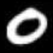
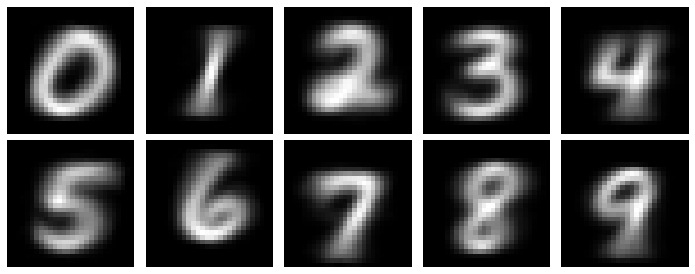
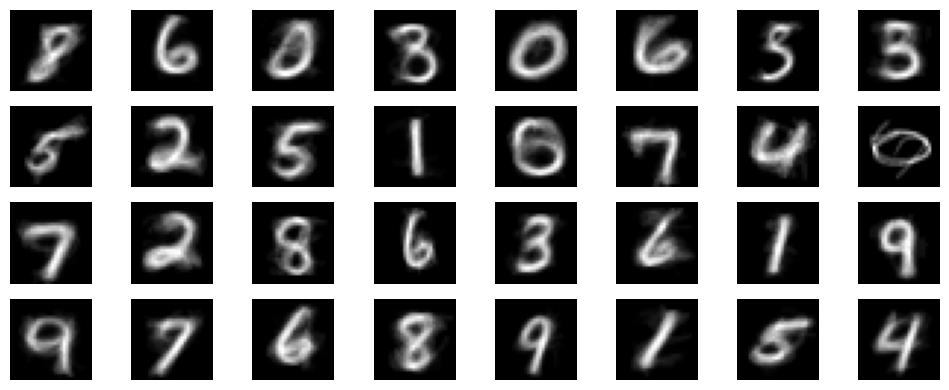
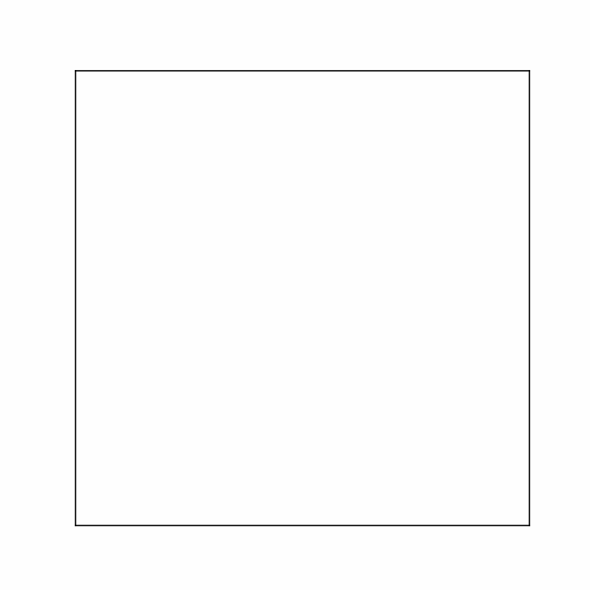
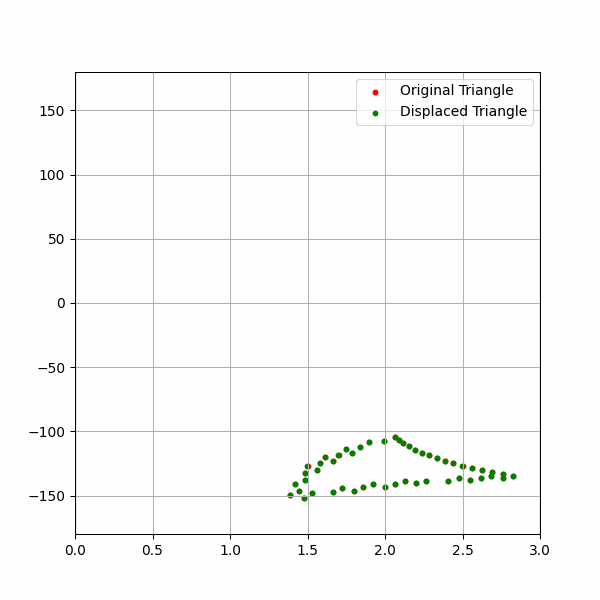

# On the Essence of Spatial Sense and Objects in Intelligence


## What is this Repo about?

This repository contains the code involved in paper *On the Essence of Spatial Sense and Objects in Intelligence* ([Xu and Wang, 2025](#how-to-cite)). By following this document, you will reproduce the results in the Example sections.

Note that the repo does not aim for a complete AGI system, but for providing technical details of the examples that help illustrate the theory proposed in the paper. Researchers may view it as a reference for future studies on developing systems capable of acquiring and understanding *space* and *objects*.


## How to reproduce the results?


Have fun with the following jupyter-notebooks!
**Example1:**
```
mnist_supervised.ipynb
mnist_unsupervised.ipynb
```
**Example2:**
```
prototype_matching.ipynb
```
**Example3:**
```
space.ipynb
```

## Technical details (🚧 WIP)

### Example 1: MNIST

### Example 1.1: Supervised learning on MNIST
In this example, we adopt a simplifed implementation of position, and two concepts attached with positions are similiar only when their positions on the matrix are the same. For example, `black` on `(0, 0)`  and `black` on `(0, 0)` are similar when their rgb values are similar; however, `black` on `(0, 1)` and `black` on `(1, 0)` are different.

For example, given the image 

the gray level of a pixel is converted to frequency, and the confidence is set to constant `0.9`. The 28x28 image can be converted to 784 *Narsese* sentences, as defined in (Xu and Wang, 2025):
```
{Image0} --> [pixel0](0,0) %0.0;0.9%
{Image0} --> [pixel1](0,1) %0.0;0.9%
...
{Image0} --> [pixel0](0,0) %0.0;0.9%
{Image0} --> [pixel210](7,13) %0.99;0.9%
...
{Image0} --> [pixel784](27,27) %0.0;0.9%
```
Ten concepts representing the 10 digits are constructed
```
Digit0, Digit1, ..., Digit9
```
For each concept, some relations are initialized with low *confidence*. For example, for `Digit0` is represented as
```
Digit0 --> [pixel0](0,0) %0.014;0.01%
Digit0 --> [pixel1](0,1) %0.020;0.01%
...
Digit0 --> [pixel0](0,0) %0.015;0.01%
Digit0 --> [pixel210](7,14) %0.011;0.01%
...
Digit0 --> [pixel784](27,27) %0.021;0.01%
```
These relations describe the prototype of digit 0, and will be revised given new experiences (i.e., images).

When `Image0` is input, the *induction*/*comparison* rule and the *revision* rule are appled, deriving the truth-values of `{Image0} <-> Digit0`, `{Image0} <-> Digit1`, ..., and `{Image0} <-> Digit9`. One of the conclusion is chosen as the classification result (e.g., `{Image0} <-> Digit1`).


After that, provided the label (e.g., `{Image0} <-> Digit0`), the *induction*/*comparison* rule is appled, deriving the truth-values of  `Digit0 --> [pixel0](0,0)`, `Digit0 --> [pixel1](0,1)`, ..., `Digit0 --> [pixel784](27,27)`, and then the *revision* rule is applied to modify the prototype (`Digit0`).
This procedure is similar to supervised learning in neural networks.

After inputing hundreds of images, the prototypes (`Digit0`, ..., `Digit9`) are visualized as the following

The gray level is the frequency value of a statement in this form
`DigitZ --> [pixelY](i,j) %f;c%`.

To simplify the implementation, we use `Node` (see `object/node.py`) to represent a pixcel concept or a digit concept. The truth-value of `{ImageX} --> [pixelY](i,j)` is cached into pixcel `Node`, `[pixelY](i,j)`. Statement like `DigitZ --> [pixelY](i,j) %f;c%` is represented by `Link` (see `object/link.py`). The truth-value of `{ImageX} <-> DigitZ` is cached into digit `Node`, `DigitZ`. The network looks similar to a fully-connected neural network, but the intepretations are quite different.


### Example 1.2: Unsupervised learning on MNIST

Using the code of Example 1.1, we extend it to unsupervised learning. 
A number of anonymous concepts are constructed, for example, `Concept0`, `Concept1`, ..., `Concept31`. Given an image, e.g., `{Image0}`, the truth-values of `{Image0} <-> Concept0`, ..., `{Image0} <-> Concept31` are derived. Since no label is provided in this stage, we pick out the concept with the highest *expecation* (calculated from the truth-value) as the candidate, and enhance its relavant relations. For example, suppose `{Image0} <-> Concept2` wins, and statements like `Concept2 --> [pixelY](i,j) %f;c%` are derived and revised.

After inputing hundreds of images, the prototypes (`Concept0`, ..., `Concept31`) are visualized as the following


### Example 2: Dynamic Prototype Matching

Here demonstrates a simple example of recognizing a triangle by eye-movement mechanisms.
Suppose the system has learned a prototype of triangle, composed of three indistinguishable vertices, and now we focus on the prototype mathcing procedure.
<!-- When seeing one vertex, the system cannot recognize where it locates. Hence, 3 guesses should be generated. -->







## How to cite?

bibtex:
```bibtex
@inproceedings{xu2024essence,
    author = {Xu, Bowen and Wang, Pei},
    editor = {Ikl{\'e}, Matthew and Kolonin, Anton and Bennett, Michael},
    title = {On the Essence of Spatial Sense and Objects in Intelligence},
    booktitle = {Artificial General Intelligence},
    year = {2025},
    doi = {doi.org/10.1007/978-3-032-00800-8_31},
    language = {en},
    publisher = {Springer Nature Switzerland},
    address = {Cham},
    pages = {350--360},
    isbn = {978-3-032-00800-8},
}
```
